# 🐉 Dragon Ball Dex

Aplicativo para a turma explorar o universo Dragon Ball **e ver uma rede de computadores funcionando de verdade**.
O computador do professor vira um **servidor** na rede do laboratório; os computadores dos alunos se conectam a ele
para buscar personagens, lutar, jogar o quiz e entrar no **placar da turma**. Tudo o que passa pela rede aparece ao vivo
no telão. Para as aulas mais animadas há três atividades que o professor liga quando quiser: a **Caça às Esferas**, a
**Conquista de Territórios** e o **Grito de Guerra** de cada aluno. E o **Modo demonstração** deixa o professor ensaiar
tudo sozinho, sem aparecer para a turma.

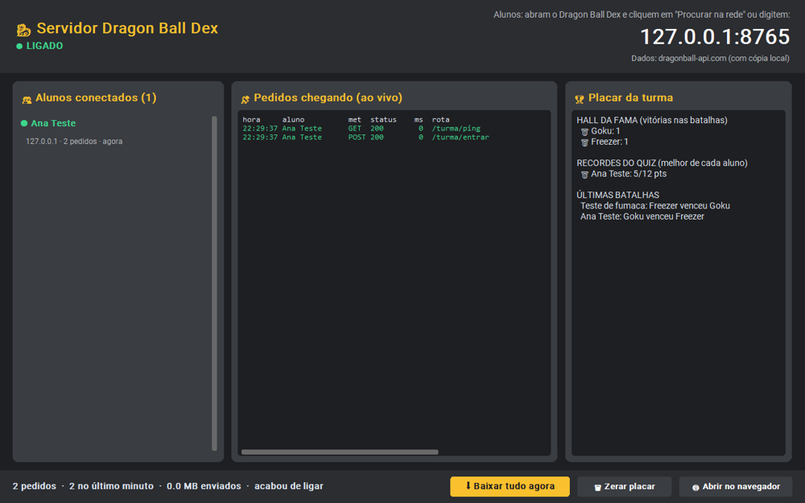

---

## Sumário

1. [Como funciona](#1-como-funciona)
2. [Instalação](#2-instalação)
3. [Usando na aula](#3-usando-na-aula)
4. [Caça às Esferas 🐉](#4-caça-às-esferas-) (2.3; mapa do radar na 2.4)
5. [Conquista de Territórios 🗺](#5-conquista-de-territórios-) (novo na 2.4)
6. [Grito de Guerra 📣](#6-grito-de-guerra-) (novo na 2.4)
7. [Modo demonstração 🎓](#7-modo-demonstração-) (novo na 2.4)
8. [O aplicativo do aluno](#8-o-aplicativo-do-aluno)
9. [O que dá para ensinar de Redes](#9-o-que-dá-para-ensinar-de-redes)
10. [Solução de problemas](#10-solução-de-problemas)
11. [Para quem vai mexer no código](#11-para-quem-vai-mexer-no-código)
12. [Versões no GitHub](#12-versões-no-github)

---

## 1. Como funciona

```
 PC do professor                                         PCs dos alunos
 ┌────────────────────────────────────┐               ┌─────────────────────────────┐
 │ "Dragon Ball Dex - Servidor"       │   rede da     │ "Dragon Ball Dex"            │
 │  • painel no telão (quem está      │   sala        │  Personagens · Batalha ·     │
 │    conectado, pedidos ao vivo,     │ ◀──────────▶  │  Planetas · Ranking · Quiz · │
 │    placar da turma)                │  HTTP 8000    │  Turma · Esferas · Conquista │
 │                                    │               │  · Rede                      │
 │  • entrega os dados e as fotos     │  UDP 50505    │                              │
 │  • guarda o placar da turma        │  (busca)      └─────────────────────────────┘
 │        │                           │
 │        └─ internet (se houver) → dragonball-api.com
 │           sem internet: usa as cópias que vêm no instalador
 └────────────────────────────────────┘
```

- **Um único programa**, dois atalhos: **Dragon Ball Dex** (aluno) e **Dragon Ball Dex - Servidor do Professor**.
- **Não precisa de internet na sala:** o servidor já vem com os dados e as fotos dos 58 personagens e 20 planetas. Se
  houver internet, ele busca a versão mais nova.
- **Também funciona sem servidor:** o aluno pode escolher "usar sem servidor (internet direto)". Só o placar da turma
  fica de fora.

---

## 2. Instalação

Na pasta `dist_instalador\` há **duas** formas de levar o programa para os computadores. Nenhuma precisa de Python:
o programa já leva tudo dentro.

| Arquivo | Quando usar |
|---|---|
| **`DragonBallDex-Setup-2.4.2.exe`** (≈ 30 MB) | **Recomendado.** Instala com atalhos e libera o servidor no Firewall |
| **`DragonBallDex-Portatil.exe`** (≈ 34 MB) | Sem instalar: copie **só este arquivo** (pendrive, Downloads...) e dê dois cliques. Demora uns segundos a mais para abrir |

### Com o instalador

1. Copie o instalador para um pendrive (ou para uma pasta compartilhada da rede).
2. Em **cada** computador (professor e alunos), dê dois cliques e avance. O Windows pede permissão de administrador.
3. Pronto: aparecem os atalhos no Menu Iniciar (e, se marcado, na Área de Trabalho).

| O que o instalador faz | Por quê |
|---|---|
| Instala em `C:\Program Files\Dragon Ball Dex` | Para todos os usuários do computador |
| Cria os atalhos "Dragon Ball Dex" e "Dragon Ball Dex - Servidor do Professor" | O mesmo programa, em dois modos |
| **Libera o programa no Firewall do Windows** | Senão os alunos não conseguem chegar ao servidor |
| Cria o desinstalador (Painel de Controle → Aplicativos) | O placar e o cache ficam em `%LOCALAPPDATA%\DragonBallDex` e não são apagados |

> **Sem senha de administrador?** Execute o instalador com `/CURRENTUSER` (ex.: `DragonBallDex-Setup-2.4.2.exe
> /CURRENTUSER`): ele instala só para aquele usuário. Nos PCs dos **alunos** isso basta. No PC do **professor**, o
> Firewall vai perguntar na primeira vez em que o servidor for aberto (pode pedir a senha de administrador): clique em
> **Permitir acesso** e marque redes privadas **e** públicas.

### Versão portátil
`DragonBallDex-Portatil.exe` funciona sozinho em qualquer pasta. Para usar como **servidor do professor**, crie um
atalho para ele e acrescente ` --servidor` no fim do campo "Destino" do atalho. Na primeira vez, o Firewall vai pedir
permissão: clique em **Permitir acesso** e marque redes privadas **e** públicas.

---

## 3. Usando na aula

### Professor (no computador ligado ao projetor)
1. Abra **Dragon Ball Dex - Servidor do Professor**.
2. O painel mostra, bem grande, o **endereço do servidor** (ex.: `192.168.0.10:8000`).
3. *(Recomendado, se houver internet)* clique em **⬇ Baixar tudo agora** para atualizar as cópias.
4. Deixe o painel no telão. Os alunos aparecem em "Alunos conectados" e cada pedido aparece em "Pedidos chegando".
5. **🗑 Zerar placar** começa uma turma nova. **🌐 Abrir no navegador** mostra a página do servidor (bom para mostrar
   que o servidor "fala HTTP" com qualquer navegador).
6. Quer ensaiar antes da aula, ou mostrar no projetor como uma atividade funciona? **🎓 Modo demonstração** (ao lado de
   "● LIGADO") abre o app do aluno num mundo de ensaio que a turma não vê (seção 7).

### Alunos
1. Abra **Dragon Ball Dex**.
2. Digite o **nome** (é ele que aparece no telão e no placar).
3. Clique em **🔍 Procurar na rede**: o endereço do servidor aparece sozinho. (Se não aparecer, digite o que está no
   telão.)
4. **Conectar ao servidor**. Pronto!
5. Na primeira vez, abre sozinho o guia **📖 Como funciona?**. Depois, ele fica no botão **❔ Como funciona?**, no
   topo de cada tela.

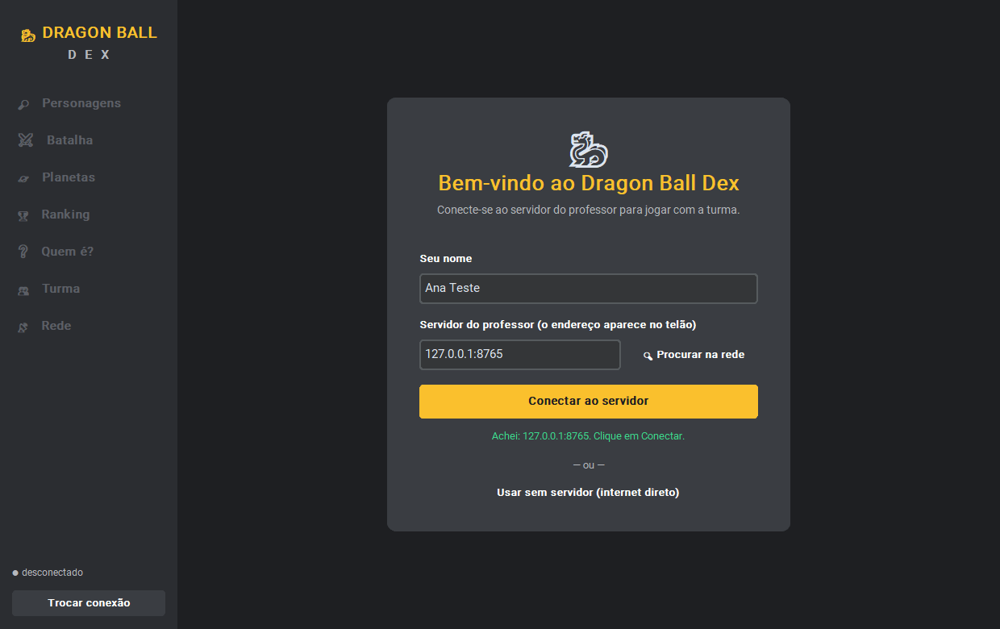

### Duelos entre alunos
Na tela **👥 Turma e duelos**, cada aluno vê quem está na sala e se está **Livre**, **Lutando** ou **No quiz**.

1. Ao lado de um colega **livre**, clique em **⚔** (batalha) ou **❓** (quiz).
2. Batalha: escolha o seu lutador e o tipo de poder. Quiz: escolha 3, 5 ou 10 rodadas. **Enviar desafio**.
3. O colega recebe um aviso na hora ("Ana te desafiou!"), escolhe o lutador dele e tem 30 s para **Aceitar** ou
   **Recusar**.
4. Aceito, os dois apps abrem o duelo:
   - **Batalha:** quem joga as rodadas é o **servidor**, e os dois veem exatamente a mesma luta. Cada um tem o seu
     botão **Transformar!** (uma vez por luta).
   - **Quiz:** as **mesmas perguntas** para os dois. Cada um responde no seu ritmo e vê o progresso do colega. Ganha
     quem fizer mais pontos; no empate, quem terminou primeiro.
5. Quem está num duelo não pode ser desafiado. Quem fecha o app (ou clica em **Desistir**) perde por W.O.

**Placar:** vitória = **3 pontos**, derrota = **1 ponto** (por ter participado; derrota por W.O. vale 0). A tela
Turma mostra o **pódio** com os 3 primeiros e a classificação de todos (vitórias/derrotas em batalha e no quiz). O
mesmo placar aparece no painel do professor. As telas Batalha e "Quem é?" do menu são **treino** contra o computador
e não contam pontos.

| | |
|---|---|
| 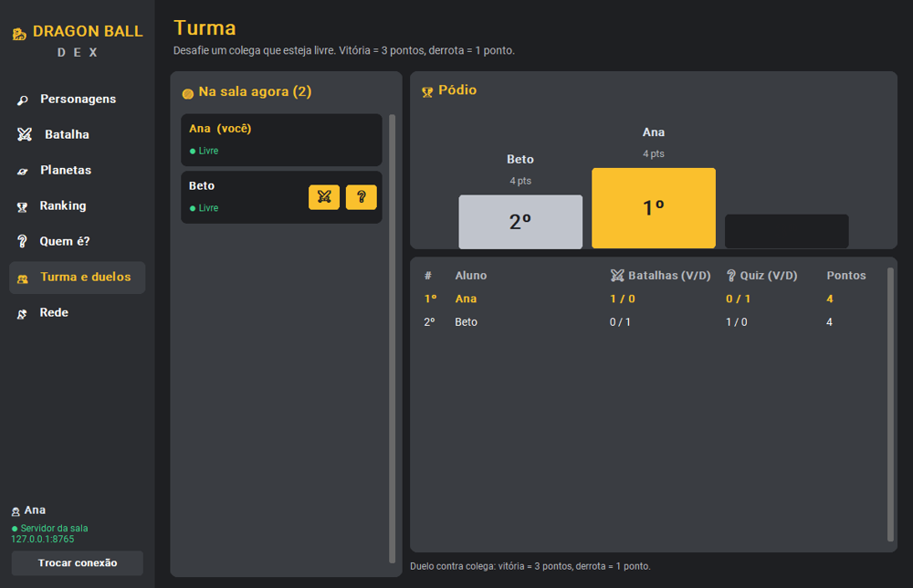 | 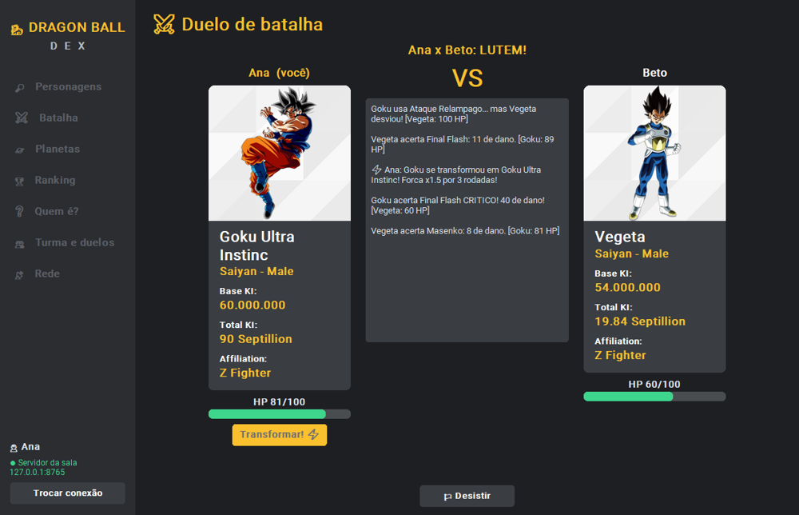 |

### Chat da turma
Os alunos conversam na tela **💬 Chat**: as próprias mensagens aparecem à direita (amarelas), as dos colegas à
esquerda e as do professor no meio, em azul. Quando chega mensagem nova, o menu mostra **💬 Chat (3)**. Cada mensagem
pode ter até 200 caracteres, e cada aluno pode mandar uma a cada 1,5 s (contra spam).

**O professor controla tudo pelo painel** (aba **💬 Chat**, no meio do painel):

| Controle | O que acontece |
|---|---|
| Interruptor **"Chat aberto para a turma"** | Desligado: **ninguém** consegue escrever (os alunos veem "O professor fechou o chat por enquanto") |
| **🔇** ao lado de um aluno (lista da esquerda) | Bloqueia **só aquele aluno**: ele continua lendo, mas não escreve. **🔊** libera de novo |
| **✕** ao lado de uma mensagem | Apaga a mensagem da tela de todos |
| **🧹 Limpar chat** | Apaga todas as mensagens |
| Campo **"Mensagem do professor"** + **📢 Enviar** | Aviso destacado para a turma (funciona mesmo com o chat fechado) |

Esses controles existem **só no painel**: não há nenhum endereço de rede para eles, então nenhum aluno consegue se
desbloquear ou reabrir o chat pelo app. As mensagens ficam apenas na memória do servidor: ao desligá-lo, o chat é
apagado.

| | |
|---|---|
| 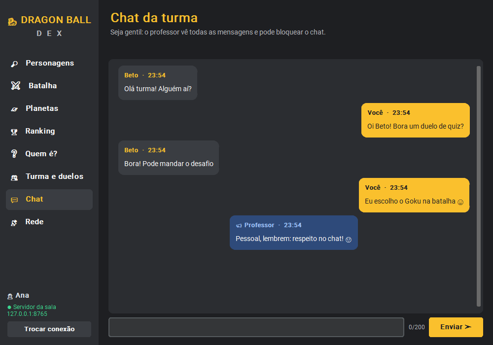 | 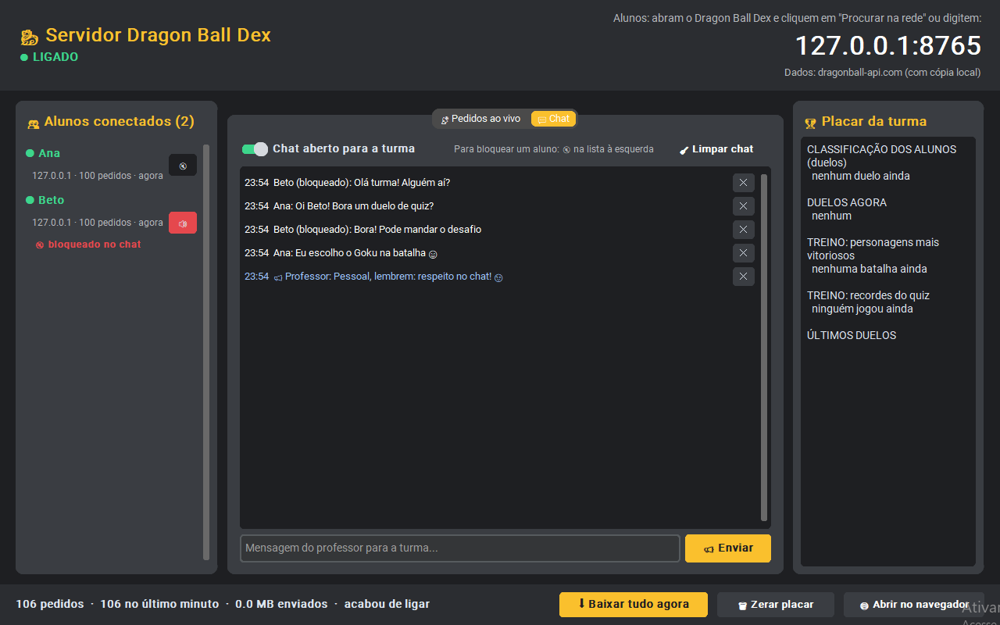 |

### Dicas de atividade
- **Corrida da conexão:** quem aparece primeiro no telão?
- **Torneio da sala:** cada aluno faz 3 duelos de batalha; o pódio mostra os campeões.
- **Desafio do quiz:** duelos de 5 rodadas, perguntas iguais para os dois.
- **Investigação de Redes:** na tela **Rede**, comparar o servidor da sala com a internet (seção 9).
- **Caça às Esferas:** 20 minutos de "caça ao tesouro" pela rede da sala (seção 4).
- **Conquista de Territórios:** 20 minutos de torneio no mapa da galáxia, com o grito de guerra de cada um (seções 5
  e 6). Bom para falar de concorrência: dois alunos clicando no mesmo planeta ao mesmo tempo.

---

## 4. Caça às Esferas 🐉

Cada aluno procura **7 Esferas do Dragão escondidas na rede da sala**, e cada esfera exige um conceito de Redes
(cabeçalhos, query string, status 404, broadcast UDP, terminal...). Quem acha uma esfera recebe um **código pessoal**
(ex.: `ESF-7KQ2M`) e o digita na tela **🐉 Esferas** do app. Cada achado aparece ao vivo no telão. Quem junta as 7
**invoca o dragão** e faz um pedido.

A caçada fica **desligada** até o professor clicar em "Iniciar caçada". Sem isso, o programa funciona exatamente como
na 2.2.

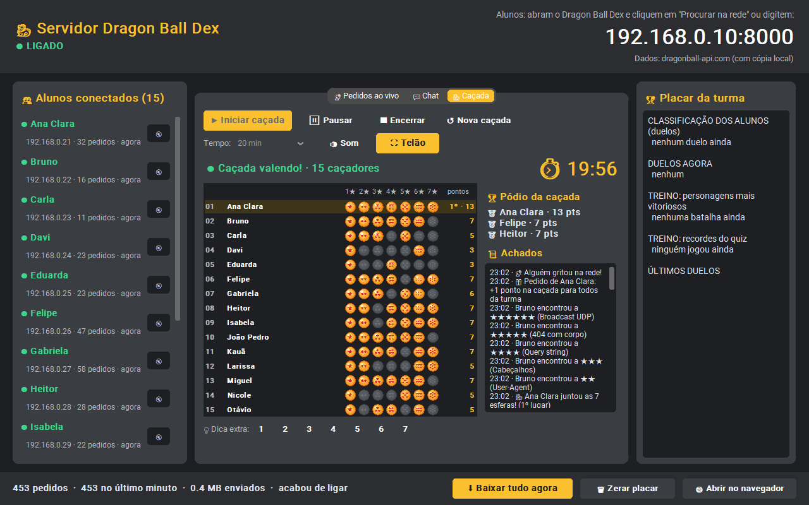

### Como usar em aula
1. Os alunos se conectam ao servidor, como sempre, e abrem a tela **🐉 Esferas**. Lá aparece o **número de caçador**
   de cada um (ex.: `07`).
2. No painel, aba **🐉 Caçada**: escolha o tempo (sem limite, ou de 10 a 45 min) e clique em **▶ Iniciar caçada**. Quem
   está na sala ganha a **1ª esfera** na hora: chegar ao servidor (IP + porta) já vale!
3. Clique em **⛶ Telão** para mostrar a grade em tela cheia no projetor (**Esc** volta ao painel).
4. A tela Esferas mostra **uma dica de cada vez**: a dica seguinte aparece quando o aluno resgata a esfera da vez.
5. A turma travou numa esfera? Clique em **💡 1** a **💡 7**. A dica extra vai como aviso do professor no chat e
   também aparece na tela Esferas de cada aluno.
6. O **1º** a juntar as 7 dispara o efeito em tela cheia: as esferas giram, vem um clarão, o dragão aparece e
   surge "O DRAGÃO FOI INVOCADO!", com o nome do aluno e as 3 opções
   de pedido, enquanto ele escolhe (até 30 s; sem escolha, vale a 1ª). Os seguintes aparecem num aviso menor no alto da
   tela. A turma toda recebe um aviso no chat ("🐉 Ana invocou o dragão!").
7. Quando o tempo acaba (ou em **■ Encerrar**), o resultado vai para um arquivo CSV, que abre no Excel, em
   `%LOCALAPPDATA%\DragonBallDex\cacadas\`. O botão **📂 Abrir pasta** mostra o arquivo.
8. **↺ Nova caçada** gera códigos novos e zera o progresso. O número de caçador de cada aluno continua o mesmo.

| Controle | O que faz |
|---|---|
| **⏸ Pausar / ▶ Retomar** | Congela a caçada: o relógio e os 30 s do pedido param. Os alunos veem "A caçada está pausada pelo professor" |
| **🔊 Som / 🔇 Mudo** | Som no PC do professor: um "plim" a cada esfera e, quando alguém invoca o dragão, o **grito de guerra** dele (seção 6). Num PC sem som, uma melodia de bipes |
| Interruptor **"Mapa do radar no app"** | Ligado (padrão): na esfera 4, a tela Esferas mostra o **mapa do radar**. Desligado: só pelo navegador, como na 2.3 |

**A figura do dragão** é o arquivo `interface/imagens/shenlong.png` (uma imagem com fundo preto). Ela vai dentro do
instalador gerado no PC que tem o arquivo, mas **não** vai para o GitHub (está no `.gitignore`). Sem ela, o efeito
mostra um dragão desenhado pelo próprio programa, como na imagem abaixo. Para trocar a figura, basta substituir o
arquivo.

**Pontos** (um placar **separado** do placar da turma; os duelos não mudam):

| | Pontos |
|---|---|
| Cada esfera encontrada | 1 |
| 1º, 2º e 3º a juntar as 7 | +5, +3 e +2 |
| Pedido "+3 pontos na caçada para mim" | +3 para quem pediu |
| Pedido "+1 ponto na caçada para todos da turma" | +1 para cada caçador |
| Pedido "Ser o ajudante do professor na próxima atividade" | Simbólico (0) |

**Contra trapaça:** o código é **pessoal**, e o de um colega não serve ("Essa esfera pertence a outro caçador! 👀").
Cada aluno pode tentar um resgate a cada 2 s, o que torna inútil chutar códigos. Os controles da caçada só existem no
painel: não há endereço de rede para iniciar, pausar ou dar dica.

| | |
|---|---|
| 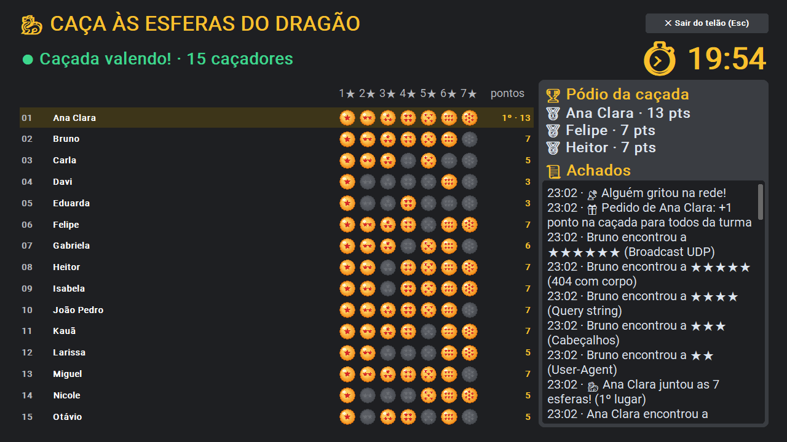 | 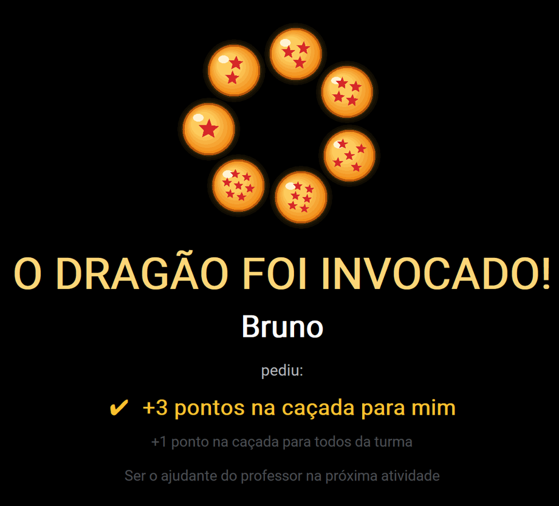 |

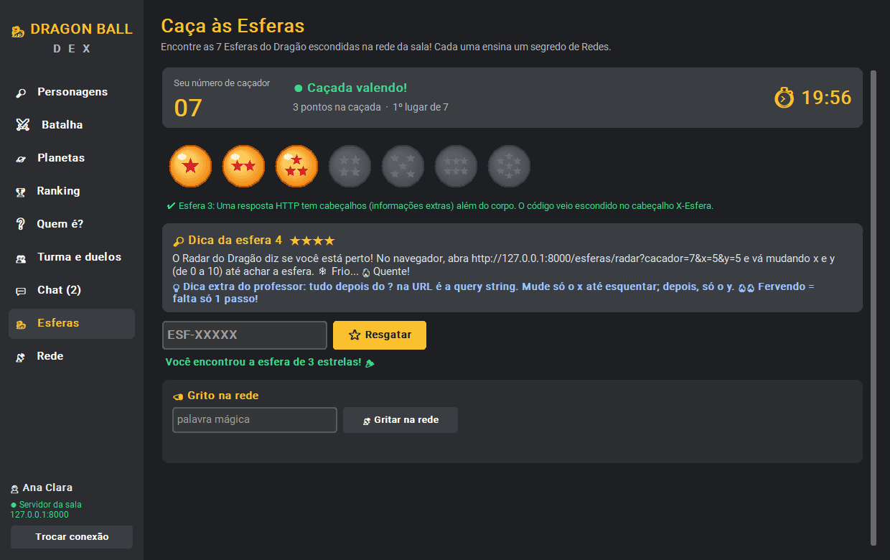

### O mapa do radar (esfera 4) — novo na 2.4
Quando a esfera 4 é a da vez, a tela Esferas mostra uma grade 11×11. Cada clique numa casa (ou setas + Enter) faz
**exatamente** o mesmo pedido que o aluno faria no navegador, e o app mostra esse pedido embaixo do mapa:
`GET /esferas/radar?cacador=7&x=5&y=5 → 200`. As casas já visitadas ficam pintadas com a temperatura (❄ frio, 🌤
morno, 🔥 quente, 🔥🔥 fervendo). Achou: o código é resgatado sozinho. O navegador continua valendo: as duas formas
falam com a mesma rota, e é isso que vale discutir.

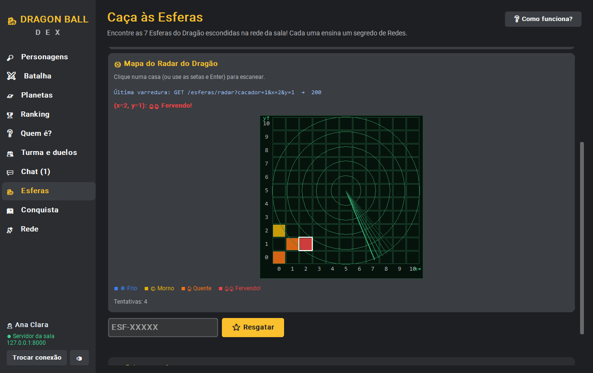

### Ensaiar sozinho antes da aula
Com o servidor aberto no PC do professor (e o código-fonte + Python instalados):

```
python ferramentas/simular_cacada.py --conectar 127.0.0.1:8000                 15 alunos falsos
python ferramentas/simular_cacada.py --conectar 127.0.0.1:8000 --velocidade 3  3 vezes mais rápido
```

Os alunos falsos entram na sala, esperam a largada e acham as esferas do mesmo jeito que um aluno faria. Às vezes eles
erram um código ou tentam usar o de um colega, e isso aparece em "Pedidos ao vivo". Dá para ensaiar várias vezes com
**↺ Nova caçada**. **Ctrl+C** para parar.

Sem Python? Use o **🎓 Modo demonstração** (seção 7): ele tem uma caçada de ensaio só sua, sempre valendo.

### O que dá para ensinar

| Esfera | Conceito | Onde o aluno procura | O que ele vê |
|---|---|---|---|
| ★ 1 | **IP + porta** | (automática) | Chegou ao servidor: já ganhou |
| ★★ 2 | **HTTP é um padrão**, **User-Agent** | Navegador → `http://IP:8000` → link "Área do caçador" | O servidor só entrega a esfera a navegadores; o app recebe **403** |
| ★★★ 3 | **Cabeçalhos HTTP** | App → 📡 Rede → Testar → `/esferas/pista` | O corpo diz "olhe com mais atenção 👀"; o código está no cabeçalho `X-Esfera` |
| ★★★★ 4 | **Query string**, **status 400** | Navegador → `/esferas/radar?cacador=7&x=5&y=5` **ou** o mapa do radar no app (o mesmo pedido) | ❄️ Frio, 🌤 Morno, 🔥 Quente, 🔥🔥 Fervendo; URL incompleta = **400** explicando como montar |
| ★★★★★ 5 | **404 também tem corpo** | Navegador → `/esferas/caverna-namek?cacador=7` | Status **404** "não encontrado"... mas o corpo traz o código |
| ★★★★★★ 6 | **Broadcast UDP** | App → 🐉 Esferas → "Gritar na rede" | Um pacote para todos os PCs (porta 50505); só o servidor responde, e só para quem gritou |
| ★★★★★★★ 7 | **Terminal como cliente HTTP** | cmd → `curl http://IP:8000/esferas/terminal?cacador=7` | Só o curl recebe o código; navegador e app recebem **403** |

Outros status que aparecem: **409** (a caçada ainda não começou ou está pausada) e **429** ("calma, espere 2 s").

### Gabarito do professor

| Esfera | Como achar | Pergunta para discutir depois |
|---|---|---|
| ★ 1 · IP + porta | Automática: basta estar conectado quando a caçada começa (quem chega depois ganha ao abrir a tela Esferas) | "Se o servidor mudasse para a porta 8001, o app ainda acharia? E se o PC do professor mudasse de IP?" |
| ★★ 2 · User-Agent | No navegador, abrir `http://IP:8000`, achar no fim da página o link discreto **🐉 Área do caçador**, digitar o número de caçador | "Como o servidor sabe que é um navegador? Dá para mentir?" (Dá: `curl -A "Mozilla/5.0" ...` engana o servidor. O User-Agent é só uma apresentação, não é segurança) |
| ★★★ 3 · Cabeçalhos | App → 📡 Rede → **Testar** → escolher `/esferas/pista` → **Enviar GET** → em "Cabeçalhos da resposta", a linha `X-Esfera: ESF-...` | "Que outras informações vêm nos cabeçalhos (Content-Type, Content-Length, Server)? Por que o navegador não mostra?" |
| ★★★★ 4 · Query string | **Duas formas.** No navegador: `http://IP:8000/esferas/radar?cacador=7&x=5&y=5`, mudando só o x até esquentar, depois só o y. **Ou** no app: clicar nas casas do mapa do radar (cada clique é o mesmo `GET`, mostrado embaixo do mapa). "Fervendo" = falta 1 passo | "O mapa e o navegador mandaram o mesmo pedido? Por que sem o x o servidor respondeu 400 e não 404? Para que servem o `?` e o `&`? Qual estratégia acha com menos tentativas?" |
| ★★★★★ 5 · 404 com corpo | Tela 🔎 Personagens → Piccolo → planeta de origem **Namek** → no navegador: `http://IP:8000/esferas/caverna-namek?cacador=7`. Outras cavernas: "Caverna vazia" | "Um erro 404 quer dizer que não veio nada? Quais status vocês já viram hoje (200, 400, 403, 404, 409, 429)?" |
| ★★★★★★ 6 · Broadcast | Tela 🐉 Esferas → "Grito na rede" → `KAMEHAMEHA` (maiúsculas e acentos tanto faz) → **📡 Gritar na rede**. O código já vai para o campo. O telão mostra "📡 Alguém gritou na rede!" | "Qual a diferença entre gritar para todos (broadcast) e mandar direto (unicast)? Por que o 'Procurar na rede' do app usa broadcast?" |
| ★★★★★★★ 7 · Terminal | Abrir o **cmd** e digitar `curl http://IP:8000/esferas/terminal?cacador=7` (a dica já vem com o IP, a porta e o número certos) | "O navegador, o app e o curl falaram com o mesmo servidor. O que os três têm em comum?" (todos falam HTTP) |

---

## 5. Conquista de Territórios 🗺

Um torneio no **mapa da galáxia**: cada aluno começa com um planeta, escolhe um **🛡 Guardião** (o personagem que
defende todos os planetas dele, mesmo com o app fechado) e tenta conquistar os planetas dos colegas e os neutros. Quem
tiver mais planetas no fim vence. Cada invasão é uma luta jogada pelo **servidor**, e o telão mostra tudo ao vivo.

A Conquista fica **desligada** até o professor clicar em **▶ Iniciar**. Ela não mexe no placar da turma (duelos) nem
na Caça às Esferas.

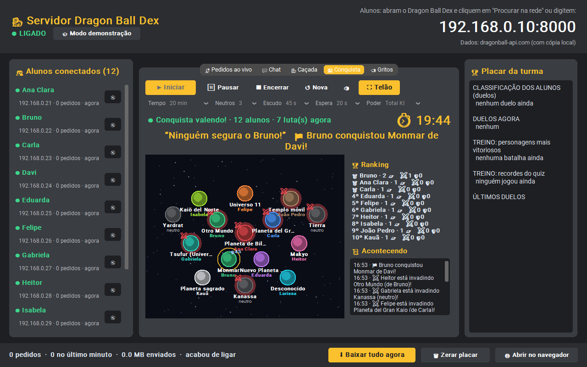

### Como usar em aula
1. Os alunos se conectam como sempre e abrem a tela **🗺 Conquista** do app.
2. No painel, aba **🗺 Conquista**, escolha **Tempo** (sem limite, ou de 10 a 45 min), **Neutros** (0 a 5 planetas sem
   dono, defendidos por um Guardião de força média), **Escudo** (proteção depois de uma conquista), **Espera** (entre
   duas invasões do mesmo aluno) e **Poder** (Total KI ou Base KI, para todas as lutas). Clique em **▶ Iniciar**: cada
   aluno online ganha um planeta sorteado.
3. **⛶ Telão** mostra o mapa, o ranking e o "Acontecendo agora" em tela cheia (**Esc** volta ao painel).
4. No app, o aluno escolhe o Guardião (pode trocar a cada 60 s), clica num planeta do mapa, clica em **⚔ Invadir** e
   escolhe o lutador. A luta abre na tela, com o botão **Transformar!**. Venceu: o planeta é dele e ganha um escudo 🛡.
   Perdeu: o Guardião defendeu.
5. Quando um planeta muda de dono, a faixa do telão mostra a **frase do grito de guerra** de quem conquistou e o grito
   toca (seção 6).
6. **■ Encerrar** (ou o fim do tempo): o resultado vai para um CSV em `%LOCALAPPDATA%\DragonBallDex\conquistas\`
   (**📂 Abrir pasta**). Uma luta em andamento é cancelada e o planeta fica com quem defendia. **↺ Nova** prepara outra.

| | |
|---|---|
| 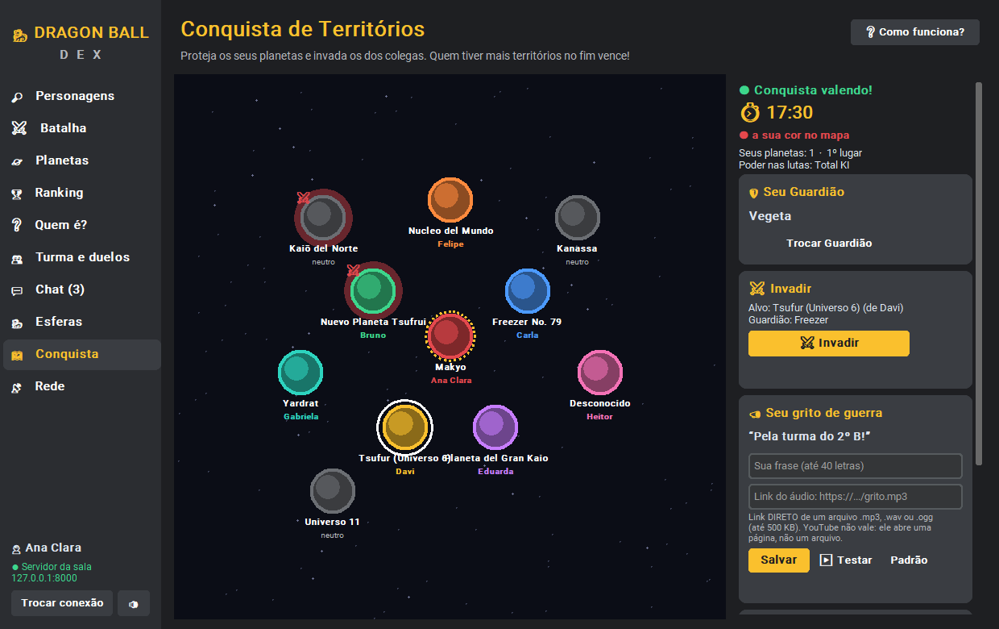 | 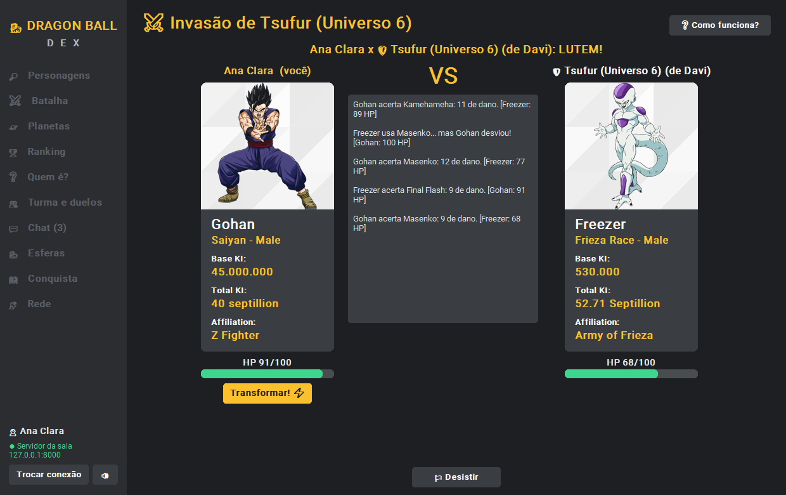 |

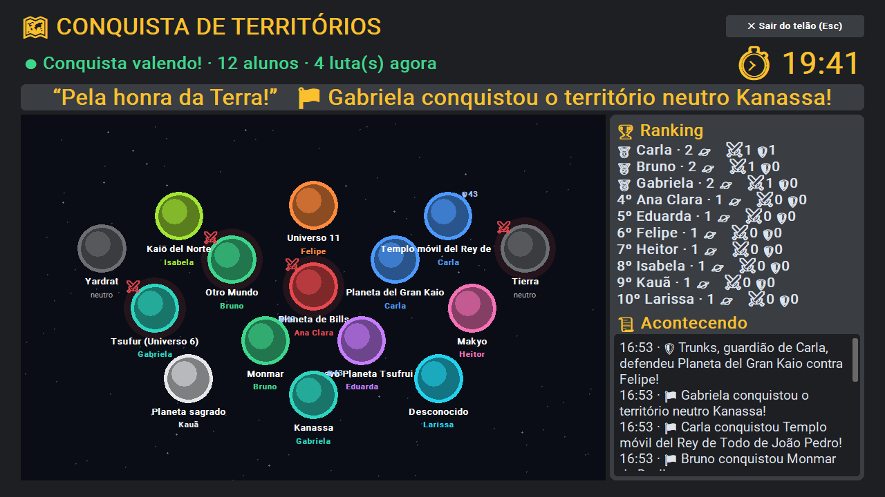

### Regras
- **Escudo:** o planeta que acabou de mudar de dono fica protegido por alguns segundos (45 s, ou o que o professor
  escolheu).
- **Espera:** depois de invadir, o aluno espera alguns segundos (20 s, ou o escolhido) para invadir de novo.
- **Um de cada vez:** um planeta só pode ser invadido por uma pessoa por vez. Se dois alunos clicarem juntos, o
  servidor deixa **só um** passar.
- **Teto de força:** nas lutas da Conquista, a força de qualquer lutador vai no máximo até a do Zeno. Sem isso, o Grand
  Priest venceria 100% das lutas e todo mundo escolheria ele.
- O Guardião **se transforma sozinho** quando fica com menos da metade da vida.
- Quem chega depois da largada entra **sem planeta** e começa invadindo um neutro. Ninguém é eliminado: quem perdeu
  tudo continua invadindo.
- **Ranking:** mais planetas → mais conquistas → mais defesas → quem chegou antes naquele número.

| Controle | O que faz |
|---|---|
| **⏸ Pausar / ▶ Retomar** | Congela o relógio; ninguém invade enquanto isso (409) |
| **🔊 / 🔇** | Som no PC do professor: o grito de quem conquista (ou bipes, num PC sem som) |

### Os erros que ensinam

| Status | Quando aparece |
|---|---|
| **403** | O planeta já é seu, ou a luta que você tentou ver é de outra pessoa |
| **404** | Esse território não existe no mapa |
| **409** | Alguém já está invadindo esse planeta, ele tem escudo, ou a Conquista está parada |
| **429** | Calma: espere para invadir de novo (ou para trocar de Guardião) |

### Ensaiar sozinho antes da aula
```
python ferramentas/simular_conquista.py --conectar 127.0.0.1:8000                 15 alunos falsos
python ferramentas/simular_conquista.py --conectar 127.0.0.1:8000 --velocidade 2  2 vezes mais rápido
```
Os alunos falsos escolhem o Guardião, trocam o grito e invadem pelas mesmas rotas do app. De vez em quando um deles
clica no próprio planeta (403), num planeta ocupado (409) ou invade rápido demais (429), e isso aparece em "Pedidos ao
vivo". Sem Python: **🎓 Modo demonstração** (seção 7).

---

## 6. Grito de Guerra 📣

Cada aluno monta o **seu grito**: uma frase (até 40 letras) e, se quiser, um áudio (`.mp3`, `.wav` ou `.ogg`, até
500 KB), que pode ser **📁 um arquivo do próprio PC** (novo na 2.4.1) ou o **link direto** de um arquivo na internet. O
grito toca no PC de quem invade e, para a turma toda, quando alguém **conquista um planeta**, **acha a esfera de 6
estrelas** ou **invoca o dragão**. Quem não monta nada usa o grito padrão: "Pela honra da Terra!" com um som gerado
pelo próprio programa.

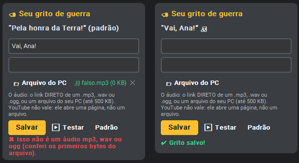

- **Onde:** no cartão **📣 Seu grito de guerra**, na tela 🗺 Conquista: escreva a frase, cole o link **ou** clique em
  **📁 Arquivo do PC** (o ✕ desfaz a escolha) e clique em **Salvar**. **▶ Testar** toca o seu; **Padrão** volta ao
  grito do programa.
- **Arquivo do PC:** o app manda o arquivo **inteiro no corpo** de um `POST /gritos/audio` (com o cabeçalho
  `Content-Type: audio/mpeg`, por exemplo, e a frase na query string). Arquivo acima de 500 KB o app nem manda.
- **Link:** quem baixa o áudio é o **servidor**, não o app (ele funciona como um *proxy*). Por isso há proteções:
  só endereços `http://` ou `https://` nas portas 80 e 443; **nada dentro da rede da escola** (roteador, impressora,
  o próprio servidor) — nem por redirecionamento; no máximo 3 redirecionamentos, 5 s e 500 KB.
- Nos dois casos o servidor confere o tipo do arquivo pelos **primeiros bytes**, não pela extensão: um `.mp3` que na
  verdade é uma página ou um programa renomeado não passa (415).
- **YouTube não vale** (decisão do professor): o link abre uma **página** de vídeo, não um arquivo de áudio, e baixar o
  som exigiria programas pesados no instalador e iria contra os termos de uso do YouTube. O app explica isso e sugere o
  📁 Arquivo do PC.
- Dá para trocar o grito a cada 10 s. Um arquivo ou link recusado sem usar a rede não gasta essa vez.
- **Som em cada PC:** o botão **🔊** no rodapé do menu liga/desliga e muda o volume (bom para quem usa fone). Os sons
  tocam **um de cada vez** (no máximo 2 esperando; o resto é descartado) e cada um dura no máximo 6 s. Sem som no PC,
  o app avisa "sem áudio neste PC" e continua mostrando a frase.
- **Quem ouve:** hoje, todos os apps da sala. Se ficar barulhento, troque uma linha em `servidor/gritos.py`:
  `QUEM_OUVE = "envolvidos"` (só quem participou).
- **A palavra mágica da esfera 6:** a frase do aluno pode ter KAMEHAMEHA, mas o programa **nunca** coloca a palavra
  sozinho em nenhum evento, aviso ou telão.

<!-- previsto: docs/imagens/som_aluno.png (janela 🔊 do app e o aviso "📣 Fulano conquistou..." no rodapé) -->

**O professor modera pelo painel** (aba **📣 Gritos**): ▶ ouve o grito de cada aluno e **🔇** bloqueia (um aluno ou os
selecionados). Bloqueado, o aluno volta na hora ao grito padrão e não consegue trocar até ser liberado (**🔊**). A
proteção é de **rede**, não de conteúdo: um áudio de mau gosto só some quando o professor bloqueia.

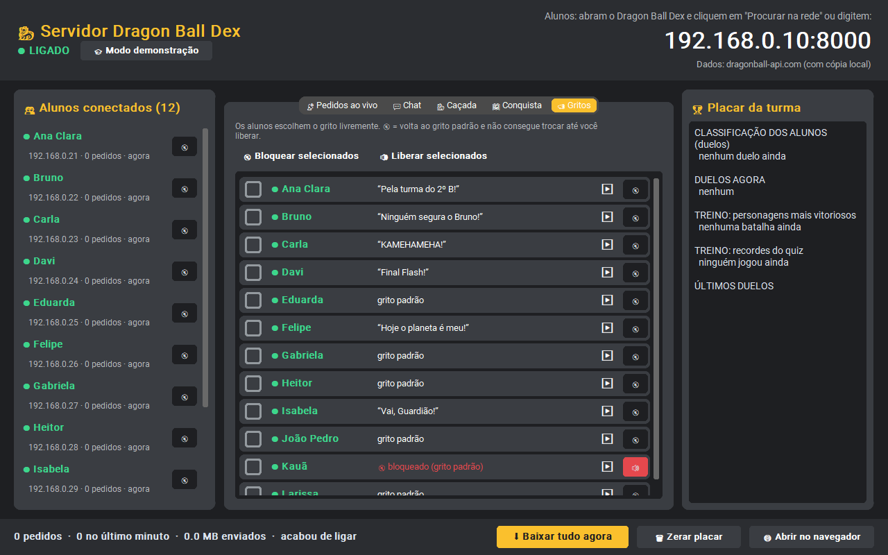

| Status ao salvar o grito | Quer dizer |
|---|---|
| **400** | Endereço inválido, arquivo vazio, ou um link do YouTube (ele abre uma **página**, não um arquivo) |
| **403** | Endereço dentro da rede da escola (bloqueado por segurança), ou o professor bloqueou o seu grito |
| **413** | Arquivo maior que 500 KB (no link; o arquivo do PC o app já barra antes de mandar) |
| **415** | Não é um áudio de verdade (mp3, wav ou ogg), conferido pelos primeiros bytes |
| **429** | Calma: espere 10 s para trocar de novo |
| **502** | O servidor não conseguiu baixar (sem internet, site fora do ar) |

---

## 7. Modo demonstração 🎓

O professor usa **a mesma visão do aluno**, em todas as telas, num **mundo de ensaio** que a turma não vê: bom para
preparar a aula ou para mostrar no projetor como cada atividade funciona.

1. No painel, clique em **🎓 Modo demonstração** (ao lado de "● LIGADO"). O app do aluno abre no mesmo PC, já
   conectado, com a faixa roxa **"🎓 MODO DEMONSTRAÇÃO: nada aqui vale pontos nem aparece para os alunos"**.
2. No ensaio há: uma **Caça às Esferas** só sua, sempre valendo (o seu número de caçador é o **901**), com o mapa do
   radar; uma **Conquista** com 2 alunos-robô 🤖 donos de 4 planetas (eles invadem sozinhos, mas nunca o seu planeta);
   e a tela **Turma** com os 2 robôs, que **aceitam desafios** de batalha e de quiz e jogam sozinhos.
3. Personagens, Planetas, Ranking, Quem é?, Batalha e 📡 Rede funcionam como sempre.
4. Feche o app (ou **Sair do demo**) e o ensaio some. Clicar de novo em 🎓 começa do zero.

| | |
|---|---|
| 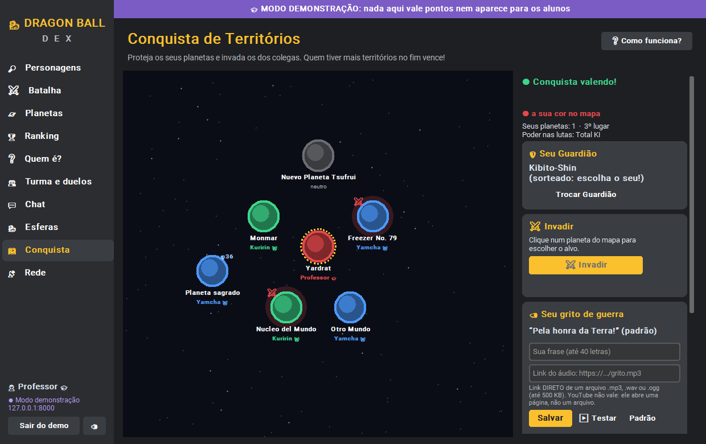 | 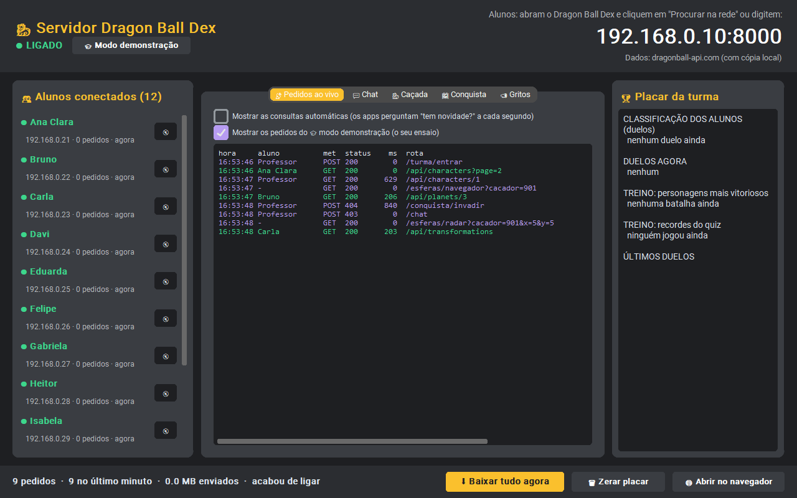 |

**Nada do ensaio aparece para a turma:** o professor não entra em "Alunos conectados", na sala, no placar, no pódio,
no mapa e no ranking da Conquista, na grade, no ranking e no CSV da Caçada. O chat do ensaio é fechado (403) e os
gritos não cruzam entre os dois mundos. Em **"Pedidos ao vivo"**, os pedidos do ensaio aparecem em roxo, com
"🎓 demo" no fim da linha (bom para a aula de Redes), e uma caixinha esconde esses pedidos.

**Esferas 2, 4, 5 e 7 no navegador ou no curl do ensaio:** use o seu número de caçador (901) no próprio PC do
servidor, por exemplo `http://127.0.0.1:8000/esferas/radar?cacador=901&x=5&y=5`. O grito da esfera 6 também
funciona no ensaio.

**Segurança:** o servidor sorteia uma senha (token) a cada vez que liga; ela só existe na memória e o painel a passa
para o app por uma variável de ambiente. O servidor só aceita essa senha vinda do **próprio PC** (127.0.0.1). Nenhum
endereço, argumento ou nome de aluno ("Professor", "demo") liga o modo demonstração: sem a senha certa, o pedido é
tratado como o de um aluno qualquer.

---

## 8. O aplicativo do aluno

| Tela | O que faz |
|---|---|
| 🔎 **Personagens** | Busca pelo nome (aceita erro: `gokuu` → "Você quis dizer Goku?") e filtros de raça, afiliação e gênero. Clique num card para ver a descrição, o planeta de origem e as transformações. |
| ⚔ **Batalha** | Treino: dois lutadores (ou 🎲), luta animada, botão **Transformar!** (uma vez por luta). |
| 🪐 **Planetas** | Os 20 planetas; clique para ver a descrição e quem nasceu lá. |
| 🏆 **Ranking** | Os mais fortes, com barras em escala de logaritmo. |
| ❓ **Quem é?** | Treino do quiz: a imagem começa quadriculada e fica mais nítida a cada erro. |
| 👥 **Turma e duelos** | Quem está na sala (para desafiar), o **pódio** e a classificação da turma (atualiza sozinho). |
| 💬 **Chat** | Conversa da turma, controlada pelo professor. |
| 🐉 **Esferas** | A Caça às Esferas (seção 4): número de caçador, dica da vez, resgate dos códigos, o mapa do radar e o grito na rede. Só com o servidor da sala, depois que o professor dá a largada. |
| 🗺 **Conquista** | A Conquista de Territórios (seção 5): o mapa da galáxia, o Guardião, as invasões, o ranking e o seu grito de guerra (seção 6). Só com o servidor da sala, depois que o professor dá a largada. |
| 📡 **Rede** | O raio-X da conexão (seção 9). |

O menu ganhou uma barra de rolagem que só aparece quando os 10 itens não cabem na altura da tela. No rodapé do menu, o
botão **🔊** liga/desliga o som dos gritos e muda o volume daquele PC.

**Ninguém fica perdido:** em todas as telas, o botão **❔ Como funciona?** (no canto de cima) abre um guia com a
explicação daquela tela: para que serve, como usar passo a passo e dicas. O guia também tem "🚀 Primeiros passos" e
"🆘 Deu problema?", e abre sozinho na primeira vez que cada aluno (pelo nome) conecta naquele computador.

| | |
|---|---|
| 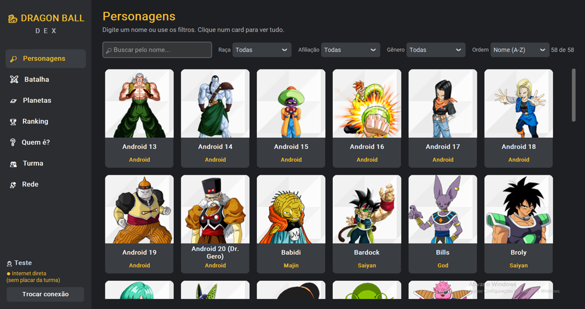 | 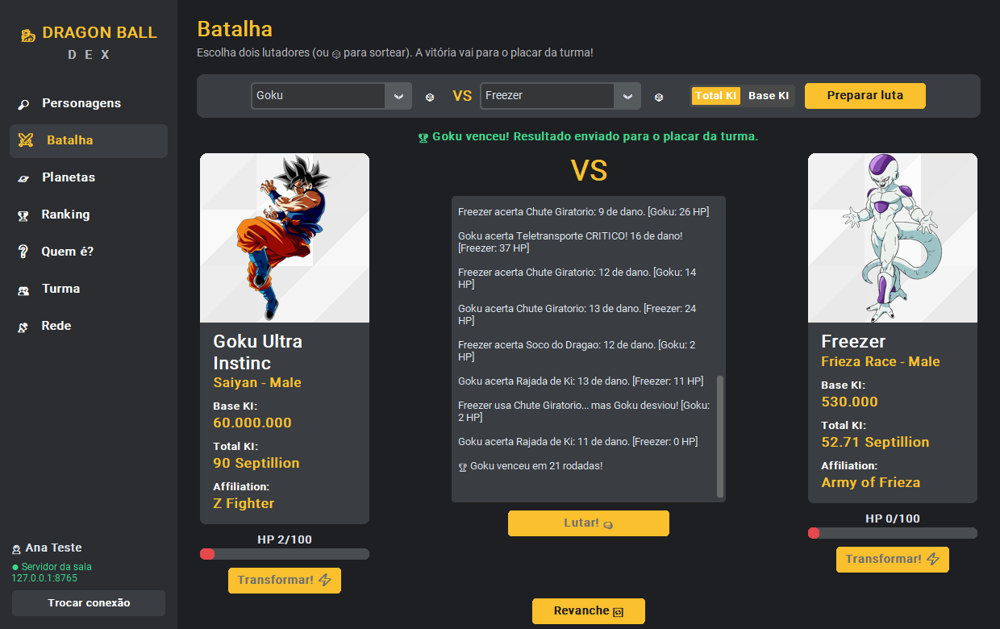 |
| 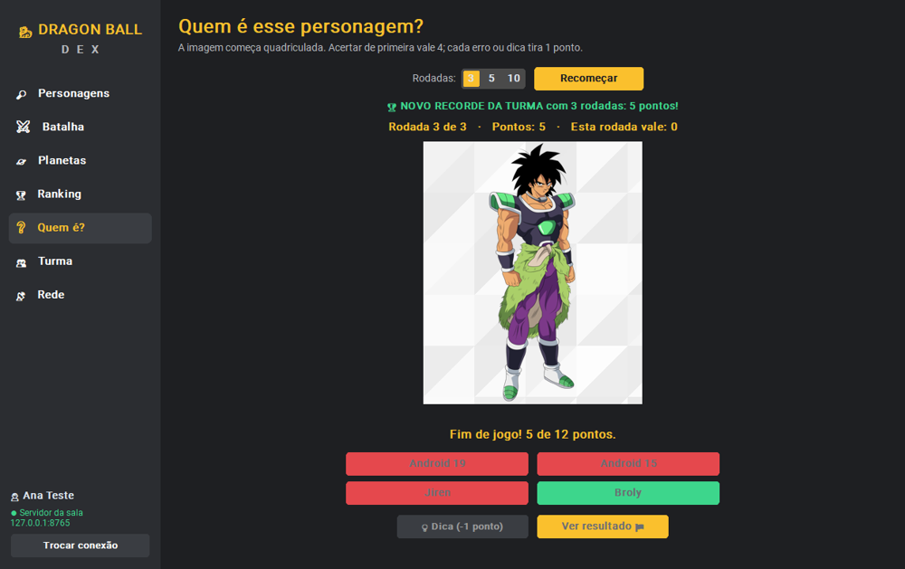 | 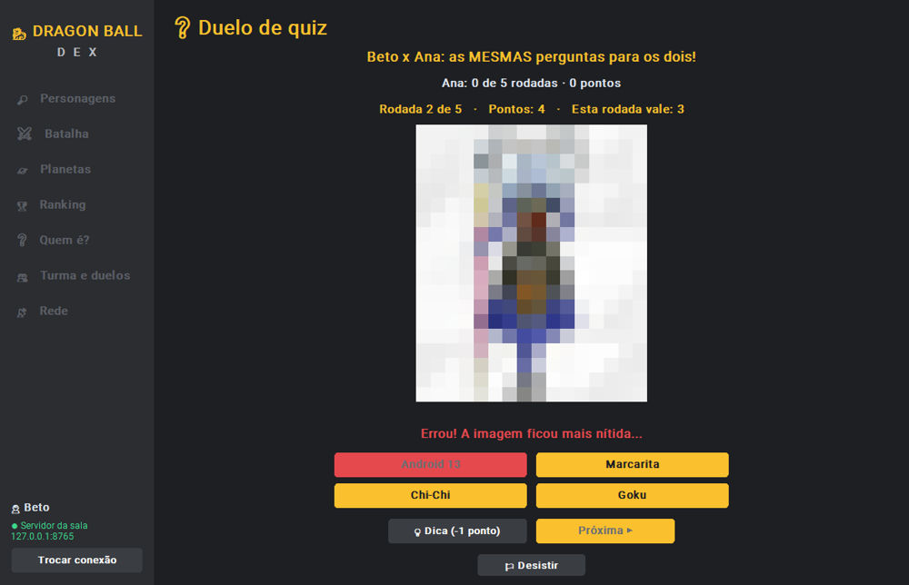 |

---

## 9. O que dá para ensinar de Redes

| Onde | Conceito | O que os alunos veem |
|---|---|---|
| Tela de conexão | **Endereço IP e porta** | `192.168.0.10:8000` = "qual computador" + "qual programa" |
| "Procurar na rede" | **Broadcast UDP** | O app grita para a rede inteira e só o servidor responde |
| Chat | **Polling** ("tem mensagem nova depois da nº 42?"), **status 403** (proibido) | No painel, marque "Mostrar as consultas automáticas" e veja os `GET /chat?depois=...` chegando a cada segundo |
| Duelos | **Estado compartilhado no servidor**, **polling** | Os dois apps perguntam ao servidor várias vezes por segundo e desenham a mesma luta |
| Painel do professor | **Cliente-servidor**, **requisições HTTP** | Cada clique de cada aluno vira uma linha: hora, aluno, método (`GET`/`POST`), **status code**, tempo, rota |
| Rede → Conexão | **IP local**, **HTTP × HTTPS**, **DNS**, **TCP**, **TLS** | Na sala não há DNS nem TLS (é `http://` com IP); na internet, há os dois |
| Rede → Pedidos | **Cache** | Pedidos `rede` × `cache`: a 2ª vez nem usa a rede |
| Rede → Testar | **URL, query string, cabeçalhos, JSON** | Montar `?page=2&limit=5`, ver os cabeçalhos e o corpo da resposta |
| Rede → Velocidade | **Latência**, **rede local × internet**, **keep-alive** | Servidor da sala ≈ 1–5 ms × internet ≈ 300 ms (medido: 79 vezes mais rápido) |
| Rede → Experimentos | **4xx × 5xx**, **timeout**, **modo offline** | 404, 400, timeout de 0,001 s, "tirar o cabo" sem tirar o cabo |
| Navegador → `http://IP:8000` | **HTTP é um padrão** | O mesmo servidor responde ao navegador e ao app |
| Caça às Esferas | **User-Agent**, **cabeçalhos**, **query string**, **400 × 403 × 404 × 409 × 429**, **broadcast × unicast**, **curl** | Uma esfera para cada conceito: veja a tabela e o gabarito na seção 4 |
| Mapa do radar (esfera 4) | **Um cliente HTTP é só um programa que monta a URL** | Cada clique no mapa mostra o `GET /esferas/radar?cacador=7&x=5&y=5` que ele mandou: o mesmo que o aluno digitaria no navegador |
| Conquista de Territórios | **Concorrência** e **trava** (*lock*), **estado no servidor**, **polling incremental** (`?depois=<id>`), **403 × 404 × 409 × 429** | Dois alunos clicam juntos no mesmo planeta: o servidor deixa só um passar e o outro recebe 409. O Guardião defende mesmo com o app do dono fechado, porque quem decide é o servidor |
| Grito de Guerra | **Upload** (o arquivo no corpo do POST, `Content-Type`, `Content-Length`), **proxy**, **SSRF**, **IP público × privado** (`192.168…`, `127.0.0.1`), **redirecionamento (3xx)**, **tipo de arquivo pelos bytes × extensão**, **limites (413)**, **415**, **502**, **cache** | O 📁 manda o arquivo inteiro num `POST` (em "Pedidos ao vivo" aparece o tamanho); o link é baixado pelo servidor, que recusa endereços de dentro da rede; um `.mp3` falso é pego pelos primeiros bytes; os apps guardam os áudios da turma antes da hora (pré-carregamento) |
| Modo demonstração | **Loopback (127.0.0.1)**, **token** (uma senha sorteada), **isolamento** | O servidor sabe que o pedido veio do próprio PC; em "Pedidos ao vivo", os pedidos do ensaio aparecem marcados com 🎓 |
| Sons em qualquer tela | **Polling** econômico | O `/turma/sala` (já perguntado a cada 1,5 s) traz só um número ("último evento"); o app só busca `/gritos/eventos` quando ele muda |

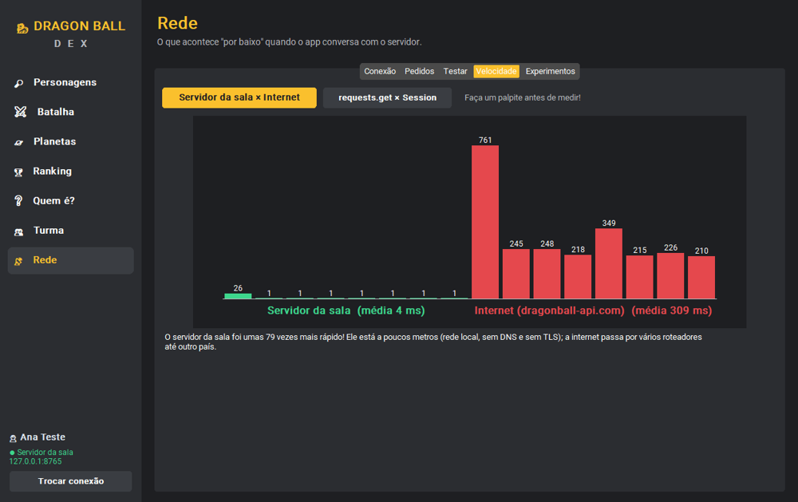

**Rotas do servidor** (dá para abrir no navegador):

| Rota | Resposta |
|---|---|
| `GET /` | Página "o servidor está funcionando" |
| `GET /api/characters` | Personagens, 10 por página (`?page=2`, `?limit=100`) |
| `GET /api/characters?race=Saiyan` | Com filtro: lista pura (como na dragonball-api original) |
| `GET /api/characters/1` | Um personagem, com planeta e transformações |
| `GET /api/planets`, `/api/planets/1`, `/api/transformations` | Planetas e transformações |
| `GET /imagens/...` | As fotos |
| `GET /turma/ping` · `GET /turma/placar` | "Sou um servidor Dragon Ball Dex" · placar da turma |
| `POST /turma/entrar` | O aluno chega e recebe um código (vai no cabeçalho `X-Jogador` dos pedidos seguintes) |
| `GET /turma/sala` | Quem está na sala (livre/lutando/no quiz), desafios recebidos e enviados, duelo atual |
| `POST /turma/desafiar` · `/turma/responder` · `/turma/cancelar` | Os desafios entre alunos |
| `GET /turma/partida/<id>` · `POST .../transformar` · `.../progresso` · `.../desistir` | O duelo (a batalha avança sozinha no servidor) |
| `GET /chat?depois=<id>` · `POST /chat` | Ler as mensagens novas e mandar uma (403 se o chat estiver fechado ou o aluno bloqueado) |
| `GET /esferas/estado` · `POST /esferas/resgatar` · `POST /esferas/pedido` | Caça às Esferas, pelo app: o progresso do aluno, resgatar um código, o pedido ao dragão (409 com a caçada parada) |
| `GET /esferas/navegador` · `/pista` · `/radar` · `/caverna-<nome>` · `/terminal` | As esferas 2, 3, 4, 5 e 7 (seção 4). A 6 é o grito UDP na porta 50505. O mapa do radar usa a mesma `/esferas/radar` |
| `GET /conquista/estado?depois=<id>` | Conquista: o mapa, os donos, os escudos, o ranking e os eventos novos (409, com os mesmos dados, se parada) |
| `POST /conquista/guardiao` · `POST /conquista/invadir` | Escolher o Guardião (`{"personagem"}`) · invadir (`{"territorio", "personagem"}` → `{"partida": "cq-..."}`); 403/404/409/429 |
| `GET /turma/partida/cq-...` · `POST .../transformar` · `.../desistir` | A luta da invasão, pela **mesma** rota dos duelos (não vai para o placar da turma) |
| `GET /gritos/meu` · `POST /gritos/meu` | O meu grito · trocar (`{"frase", "url"}`, o servidor baixa a URL) ou `{"padrao": true}`; 400/403/413/415/429/502 |
| `POST /gritos/audio?frase=...` | Um áudio do PC do aluno: o arquivo inteiro no corpo (`Content-Type: audio/mpeg`, `audio/wav` ou `audio/ogg`; até 500 KB); 400/403/413/415/429 |
| `GET /gritos/eventos?depois=<id>` | Os eventos de som novos e a lista de áudios da turma para pré-carregar |
| `GET /gritos/<hash>.mp3` · `GET /gritos/padrao.wav` | Os áudios (o padrão é gerado pelo programa) |
| Cabeçalho `X-Demo` | Só no modo demonstração, só aceito vindo de 127.0.0.1 com o token certo (seção 7) |

Com a Caça ou a Conquista valendo, a resposta de `GET /turma/sala` ganha o campo `"novidades"` (número do último
evento de som e versão dos gritos). Com as duas desligadas, ela fica igual à da 2.3.2. Iniciar, pausar, encerrar,
bloquear gritos e ligar o modo demonstração **não têm rota**: só existem no painel.

---

## 10. Solução de problemas

| Sintoma | Causa provável | O que fazer |
|---|---|---|
| "Procurar na rede" não acha nada | A rede da escola bloqueia broadcast, ou o PC do aluno está em outra rede (ex.: Wi-Fi × cabo) | Digite o endereço do telão. Confira se todos estão na mesma rede |
| "Não consegui conectar" | Firewall bloqueando o servidor, endereço errado ou servidor desligado | Confira o endereço. No PC do professor: Firewall do Windows → permitir "Dragon Ball Dex" (o instalador já faz isso). Teste no navegador do aluno: `http://IP:8000` |
| Funciona no PC do professor, mas não nos alunos | Firewall do PC do professor (rede marcada como "Pública") | Reinstale como administrador ou permita manualmente o `DragonBallDex.exe` |
| O endereço no telão é `127.0.0.1` | O PC do professor está sem rede | Conecte o cabo/Wi-Fi e abra o servidor de novo |
| A porta mudou para 8001 | A 8000 já estava em uso (outro servidor aberto?) | Use o endereço que aparece no telão |
| "Sem conexão: usando dados salvos" | O servidor caiu, ou o aluno está offline | O app continua funcionando com o que já baixou. Reconecte em "Trocar conexão" |
| Fotos aparecem "sem imagem" | Sem internet e a foto não estava nas cópias | No servidor: "⬇ Baixar tudo agora" quando houver internet |
| "Failed to load Python DLL ... `_internal\python3xx.dll`" | Foi copiado só o `DragonBallDex.exe` de uma pasta de build, sem a pasta `_internal` que fica ao lado dele | Use o **instalador** ou o **`DragonBallDex-Portatil.exe`** (que funciona sozinho) |
| A janela fica maior que a tela, ou os cards da direita aparecem cortados | (corrigido na 2.1) Escala de tela do Windows em 125%/150% | Atualize para a versão 2.1. A janela agora se ajusta e abre maximizada em telas pequenas |
| O aluno não consegue escrever no chat | O professor fechou o chat ou bloqueou aquele aluno (a mensagem aparece no topo da tela do Chat) | No painel: interruptor "Chat aberto" ligado e 🔊 ao lado do nome |
| A lista "Pedidos ao vivo" não mostra os pedidos de sala/chat | Os apps perguntam "tem novidade?" a cada segundo; essas consultas ficam escondidas para não lotar a lista | Marque "Mostrar as consultas automáticas" (bom para mostrar o polling em aula) |
| O botão de desafio está apagado | O colega está num duelo, ou você já está esperando outra resposta | Espere ele terminar (o estado aparece ao lado do nome) |
| Quero testar um computador | — | Abra `DragonBallDex.exe --fumaca` (pelo "Executar" do Windows): o app passa por todas as telas sozinho e grava o resultado em `%LOCALAPPDATA%\DragonBallDex\fumaca.txt` |
| **Caçada:** ninguém recebe resposta do "Gritar na rede" (esfera 6) | A rede da escola (ou o Firewall) bloqueia broadcast, igual ao "Procurar na rede" | Clique em **💡 6** no painel: aparece no app a opção **"Mandar direto para o servidor (unicast)"**, que manda o pacote UDP só para o IP do servidor |
| **Caçada:** "'curl' não é reconhecido como um comando" (esfera 7) | Windows 10 antigo (antes da versão 1803) não tem o curl | Use o PowerShell: `iwr -UseBasicParsing "http://IP:8000/esferas/terminal?cacador=7"` e leia a linha `Content` (o PowerShell também vale como terminal) |
| **Caçada:** no PowerShell, `curl` dá um erro sobre o "Internet Explorer" | No PowerShell, `curl` é um apelido de outro comando (`Invoke-WebRequest`) | Digite `curl.exe` (com o `.exe`) ou use o **cmd** |
| **Caçada:** "Essa esfera pertence a outro caçador! 👀" | O aluno usou o código de um colega | Os códigos são pessoais: cada um precisa achar o seu (com o próprio número de caçador) |
| **Caçada:** "Calma! Espere 2 segundos..." | Duas tentativas de resgate seguidas | Esperar 2 s. É a proteção contra quem tenta chutar códigos |
| **Caçada:** a tela Esferas diz "Este servidor não tem a Caça às Esferas" | O PC do professor ainda está com a versão 2.2 | Instale a 2.3 no PC do professor |
| **Caçada:** o link "Área do caçador" não aparece na página do servidor | A caçada não está valendo (ainda não começou ou está pausada) | Inicie ou retome a caçada e recarregue a página (F5) |
| **Caçada:** o radar responde 400 | Faltou o `cacador`, o `x` ou o `y`, ou um valor está fora de 0 a 10 | A própria resposta explica como montar a URL |
| **Caçada:** um aluno fica na grade com 1 esfera e não sai disso | O PC dele está com o app 2.2 (sem a tela Esferas) | Atualize o app naquele PC |
| **Caçada:** no painel, o nome do aluno fica embaixo das esferas | (corrigido na 2.4.2) Com poucos alunos, as esferas cresciam demais | Atualize o PC do professor para a 2.4.2 |
| **Conquista:** no telão, o nome de um planeta fica escondido atrás de outro planeta | (corrigido na 2.4.2) Com poucos planetas, eles ficavam juntos no meio da tela | Atualize o PC do professor para a 2.4.2 (agora o mapa se espalha e os nomes ficam por cima, com fundo escuro) |
| Um teste do grito UDP (`test_grito_udp_e_a_descoberta_antiga_continua_igual`) falha às vezes | O servidor do Dragon Ball Dex está aberto no mesmo PC e também responde ao grito na porta 50505 | Feche o servidor antes de rodar `tests/rodar_testes.py` |
| No app, os itens do menu não cabem na tela | Tela 1366×768 com escala de 125% (o menu tem 10 itens) | (corrigido na 2.4) Aparece uma barra de rolagem no menu; o rodapé ("Trocar conexão", 🔊) fica sempre visível |
| **Caçada:** na esfera 4, o campo "Resgatar" sumiu embaixo do mapa do radar | (corrigido na 2.4) A tela Esferas não rolava | Atualize para a 2.4. O código achado pelo mapa é resgatado sozinho |
| **Caçada:** o mapa do radar não aparece na esfera 4 | O interruptor "Mapa do radar no app" (aba 🐉 Caçada) está desligado | Ligue o interruptor, ou use o navegador (a dica mostra o endereço) |
| **Conquista:** "Esse território já é seu!" (403) | O aluno clicou no próprio planeta | Escolher o planeta de outra pessoa (os seus têm um anel amarelo) |
| **Conquista:** "...já está sendo invadido" ou "...está protegido por um escudo" (409) | Outro aluno chegou antes, ou o planeta acabou de mudar de dono | Escolher outro alvo ou esperar o escudo acabar (os segundos aparecem no mapa) |
| **Conquista:** "Calma! Espere ... s para invadir de novo" (429) | A espera entre invasões | Esperar. O professor ajusta a espera no painel |
| **Conquista:** o aluno não tem planeta | Ele chegou depois da largada | É normal: ele começa invadindo um planeta neutro (cinza) |
| **Conquista:** a tela diz "Este servidor não tem a Conquista de Territórios" | O PC do professor está com uma versão antiga | Instale a 2.4 no PC do professor |
| **Grito:** "Link do YouTube não vale" (400) | O YouTube abre uma página, não um arquivo de áudio | Usar **📁 Arquivo do PC** (um `.mp3`, `.wav` ou `.ogg`) ou o link direto de um arquivo (o endereço termina no arquivo) |
| **Grito:** "O arquivo tem ... KB e o limite é 500 KB" | O áudio escolhido no 📁 é grande demais | Cortar o áudio (5 a 6 s bastam) ou salvar em `.mp3`, que fica bem menor que o `.wav` |
| **Grito:** a janela do 📁 não mostra o meu arquivo | Ela só mostra `.mp3`, `.wav` e `.ogg` | Converter o áudio para um desses formatos (`.m4a`, `.wma`, vídeos etc. não tocam) |
| **Grito:** "...aponta para dentro da rede... bloqueado por segurança" (403) | O link é de um computador da escola (ou do próprio servidor) | É a proteção contra SSRF. Usar um link da internet |
| **Grito:** "Isso não é um áudio mp3, wav ou ogg" (415) ou "O arquivo passa de 500 KB" (413) | O arquivo não é mp3/wav/ogg de verdade, ou passa de 500 KB | Converter ou cortar o áudio (5 a 6 s bastam) |
| **Grito:** "Não achei esse endereço..." (502) | O PC do professor está sem internet, ou o site está fora do ar | Usar só a frase (o som padrão toca) |
| **Grito:** "sem áudio neste PC" | O PC não tem placa de som/caixa, ou faltou a biblioteca de áudio | A frase continua aparecendo. Para conferir um PC: `DragonBallDex.exe --fumaca` grava a linha "Som:" no `fumaca.txt` |
| **Grito:** a sala ficou barulhenta | 15 PCs tocando o mesmo grito | Cada aluno usa o 🔊 do menu (mudo ou volume). Ou, no código, `QUEM_OUVE = "envolvidos"` em `servidor/gritos.py` |
| **Demonstração:** o botão 🎓 não abre o app | Antivírus ou o atalho do servidor apontando para outro programa | Abra o servidor pelo atalho do instalador. `DragonBallDex.exe --demo` sozinho não funciona: ele precisa da senha que só o painel passa |
| **Demonstração:** "Não consegui abrir o modo demonstração" | O servidor foi fechado ou reiniciado | Feche o app do ensaio e clique em 🎓 de novo |

---

## 11. Para quem vai mexer no código

Python 3.9+ · `requests`, `customtkinter`, `pillow` e `miniaudio` (só o app do aluno usa, para o som dos gritos) ·
servidor só com a biblioteca padrão (`http.server`).

```
python -m venv .venv
.venv\Scripts\activate
pip install -r requirements.txt

python main.py                         aplicativo do aluno
python main.py --servidor              servidor + painel
python main.py --servidor --sem-janela servidor só no terminal
python main.py --fumaca [--conectar IP:PORTA]
python tests/rodar_testes.py           126 testes (sem internet; o servidor de teste usa 127.0.0.1)
python ferramentas/simular_cacada.py --conectar IP:PORTA       alunos falsos para ensaiar a caçada
python ferramentas/simular_conquista.py --conectar IP:PORTA    alunos falsos para ensaiar a Conquista
```

**Gerar o instalador** (Windows, com [Inno Setup 6](https://jrsoftware.org/isinfo.php) instalado):

```
pip install -r requirements.txt -r requirements-dev.txt     (com um Python de python.org, não o da Microsoft Store)
python instalador/construir.py        ->  dist_instalador\DragonBallDex-Setup-2.4.2.exe  e  DragonBallDex-Portatil.exe
```

| Pasta | Conteúdo |
|---|---|
| `core/` | Lógica sem interface: dados (`api.py`), imagens, poder/ki, batalha, quiz, filtros, rede, placar (`turma.py`), busca na rede (`descoberta.py`), Caça às Esferas (`esferas.py`: códigos, radar, pontos; `esferas_cliente.py`: o lado do aluno), o lado do aluno da Conquista e do grito (`conquista_cliente.py`, `gritos_cliente.py`), o som padrão (`grito_padrao.py`) e o modo demonstração no app (`demo.py`) |
| `servidor/` | O servidor do professor: rotas HTTP, espelho da API, placar da turma, monitor ao vivo, rotas da caçada (`rotas_esferas.py`), a Conquista (`conquista.py`, `rotas_conquista.py`), o grito (`gritos.py`, `rotas_gritos.py`, `baixar_audio.py`: o download com proteção contra SSRF) e o mundo de ensaio (`mundo_demo.py`) |
| `interface/` | CustomTkinter: `app_aluno.py`, `painel_servidor.py`, `telas/`, componentes (card, mini-card...), aba e telão da caçada (`aba_cacada.py`), efeito do dragão (`efeito_dragao.py`), guia "Como funciona?" (`ajuda.py`), mapa da galáxia (`mapa_galaxia.py`), mapa do radar (`radar.py`), abas da Conquista e dos Gritos (`aba_conquista.py`, `aba_gritos.py`), o som (`audio.py`, `som_da_turma.py`) |
| `dados/` | Cópia dos dados da API (usada sem internet) · `ferramentas/gerar_snapshot.py` atualiza |
| `ferramentas/` | `gerar_snapshot.py`, `explorar_api.py`, `simular_cacada.py` e `simular_conquista.py` (ensaios) |
| `cache/imagens/` | Fotos que vão dentro do instalador |
| `instalador/` | Ícone, roteiro do Inno Setup e `construir.py` |
| `tests/` | Testes automáticos |
| `docs/` | `API_NOTAS.md` (o que descobrimos da API), `ANALISE.md`, `DECISOES.md`, `PLANO_ESFERAS.md` e `PLANO_TERRITORIOS.md` (como a caçada e a 2.4 foram encaixadas sem mexer no que já funcionava) |
| `arquivo_versao_aulas.zip` | A versão anterior (roteiro de aulas, terminal + janelas), guardada |

**Imagens do README** (`docs/imagens/`). Novas na 2.4, já no repositório: `radar_mapa.png`, `conquista_aluno.png`,
`invasao.png`, `painel_conquista.png`, `telao_conquista.png`, `painel_gritos.png`, `demo_app.png`,
`painel_demo.png` e (2.4.1) `grito_aluno.png`. **Prints que ainda faltam** (o lugar já está marcado no README como
comentário `previsto:`):

- `docs/imagens/som_aluno.png`: a janela 🔊 do app e o aviso "📣 Fulano conquistou..." no rodapé de outra tela;
- (opcional) uma foto do laboratório com o telão da Conquista e os alunos jogando.

---

## 12. Versões no GitHub

O código está em [github.com/DiegoSousaOliveira/app_dragonball_api](https://github.com/DiegoSousaOliveira/app_dragonball_api).

| Branch · tag | O que tem |
|---|---|
| `main` · `v2.2.0` | A versão estável (duelos, pódio, chat), **sem** a Caça às Esferas |
| `cacada-esferas` · `v2.3.0` | A versão 2.3, **com** a Caça às Esferas (dragão desenhado) |
| `cacada-esferas` · `v2.3.1` | Igual à 2.3.0, mas o efeito usa a figura `interface/imagens/shenlong.png` quando ela está no PC |
| `cacada-esferas` · `v2.3.2` | A 2.3.1 + o guia **❔ Como funciona?** em todas as telas do app do aluno |
| `conquista-territorios` · `v2.4.0` | A 2.3.2 + **Conquista de Territórios**, **mapa do radar** (esfera 4), **Grito de Guerra** e **Modo demonstração** |
| `conquista-territorios` · `v2.4.1` | A 2.4.0 + o grito de guerra aceita **📁 um arquivo de áudio do próprio PC** (o YouTube continua fora) |
| `conquista-territorios` · `v2.4.2` | Correções no painel: o nome do aluno não fica mais embaixo das esferas na Caçada, e os nomes dos planetas não ficam mais escondidos no telão da Conquista |

```
git checkout main                     volta para a versão estável (2.2)
git checkout cacada-esferas           volta para a versão com a caçada (2.3)
git checkout conquista-territorios    a versão 2.4 (Conquista, grito e modo demonstração)
```

Depois de trocar de versão, gere o instalador de novo antes de levar para o laboratório (a pasta `dist_instalador\`
não vai para o GitHub e fica com o último instalador gerado).

---

Dados e imagens: [Dragon Ball API](https://dragonball-api.com). Dragon Ball pertence aos seus detentores (Akira
Toriyama / Bird Studio / Shueisha / Toei Animation). **Uso exclusivamente educacional.**
